# Dockerized System Monitor

A multi-container Docker application that displays system information, tracks application visits using MySQL, and demonstrates Docker networking, volumes, health checks, and container orchestration with Docker Compose.

---

## Project Overview

This project combines a Python Flask web application with a MySQL database running in separate Docker containers.

The application displays:

* Hostname
* Container IP Address
* Operating System
* Current Time
* Python Version
* Container ID
* Application Version
* Platform Information
* Persistent Visit Counter

The visit counter is stored in MySQL and persists across container restarts using Docker Volumes.

---

## Architecture

```text
Browser
   │
   ▼
Flask Application Container
   │
   ▼
Docker Compose Network
   │
   ▼
MySQL Database Container
   │
   ▼
Docker Volume (Persistent Storage)
```

---

## Technologies Used

* Python 3.12
* Flask
* MySQL 8.4
* Docker
* Docker Compose
* Docker Volumes
* Docker Networks

---

## Project Structure

```text
Dockerized-System-Monitor/
├── .gitignore
├── README.md
├── app
│   ├── .dockerignore
│   ├── Dockerfile
│   ├── app.py
│   └── requirements.txt
├── db
│   └── init.sql
├── docker-compose.yml
└── screenshots
    ├── Application_Dashboard.png
    ├── DockerCompose_Logs.png
    ├── DockerCompose_Ps.png
    ├── DockerNetwork_Inspect.png
    ├── DockerVolume_Inspect.png
    ├── Docker_Build.png
    ├── Docker_Image.png
    ├── Docker_Output-1.png
    ├── Docker_Output-2.png
    ├── Docker_Ps-Logs.png
    ├── Docker_Run.png
    ├── Health_Endpoint.png
    └── Volume_Persistence.png
```

---

## Features

### Containerized Flask Application

* Runs inside a Docker container
* Displays runtime system information
* Uses environment variables for configuration

### Multi-Container Architecture

* Flask application container
* MySQL database container
* Managed using Docker Compose

### Persistent Storage

* Uses Docker Named Volumes
* Database data survives container restarts

### Health Monitoring

* Dedicated `/health` endpoint
* Docker HEALTHCHECK integration

### Container Networking

* Automatic service discovery through Docker Compose
* Flask communicates with MySQL using service names

### Database Initialization

* Automatic schema creation during container startup
* Uses SQL initialization scripts

---

## Database Schema

```sql
CREATE TABLE visits (
    id INT PRIMARY KEY,
    visit_count INT NOT NULL
);
```

Initial record:

```sql
INSERT INTO visits (id, visit_count)
VALUES (1, 0);
```

---

## Environment Variables

### Web Container

| Variable    | Description         |
| ----------- | ------------------- |
| APP_VERSION | Application version |
| DB_HOST     | MySQL hostname      |
| DB_USER     | Database username   |
| DB_PASSWORD | Database password   |
| DB_NAME     | Database name       |

### MySQL Container

| Variable            | Description      |
| ------------------- | ---------------- |
| MYSQL_ROOT_PASSWORD | Root password    |
| MYSQL_DATABASE      | Initial database |

---

## Build and Run

Clone the repository:

```bash
git clone https://github.com/<your-github-username>/Dockerized-System-Monitor.git
cd Dockerized-System-Monitor
```

Start the application:

```bash
docker compose up -d --build
```

Verify running containers:

```bash
docker compose ps
```

Access the application:

```text
http://localhost:5000
```

Health endpoint:

```text
http://localhost:5000/health
```

---

## Useful Commands

### View Running Containers

```bash
docker ps
```

### View Docker Compose Status

```bash
docker compose ps
```

### View Logs

```bash
docker compose logs -f
```

### Stop Containers

```bash
docker compose down
```

### Remove Containers and Volumes

```bash
docker compose down -v
```

### Inspect Volume

```bash
docker volume inspect dockerized-system-monitor_mysql_data
```

### Inspect Network

```bash
docker network inspect dockerized-system-monitor_default
```

---

## Screenshots

### Docker Build

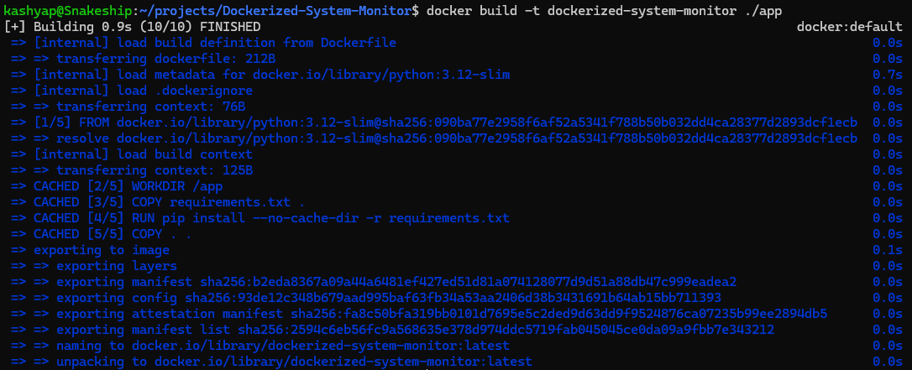

### Docker Image

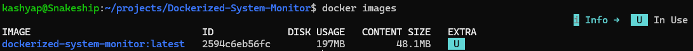

### Docker Run

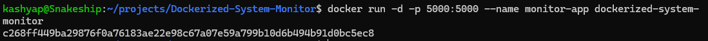

### Application Output

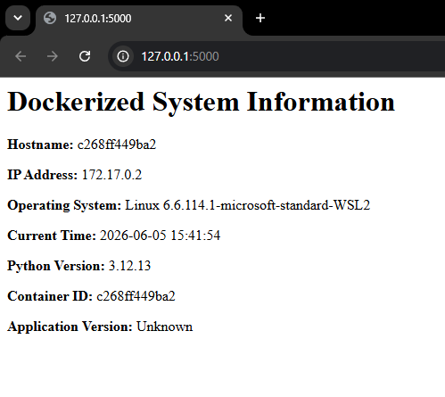

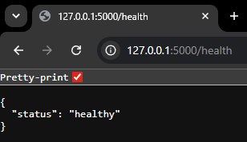

### Docker Logs and Status

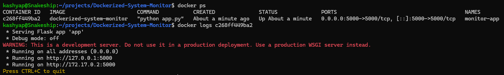

### Docker Compose Services

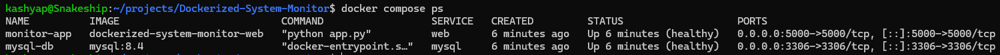

### Docker Compose Logs

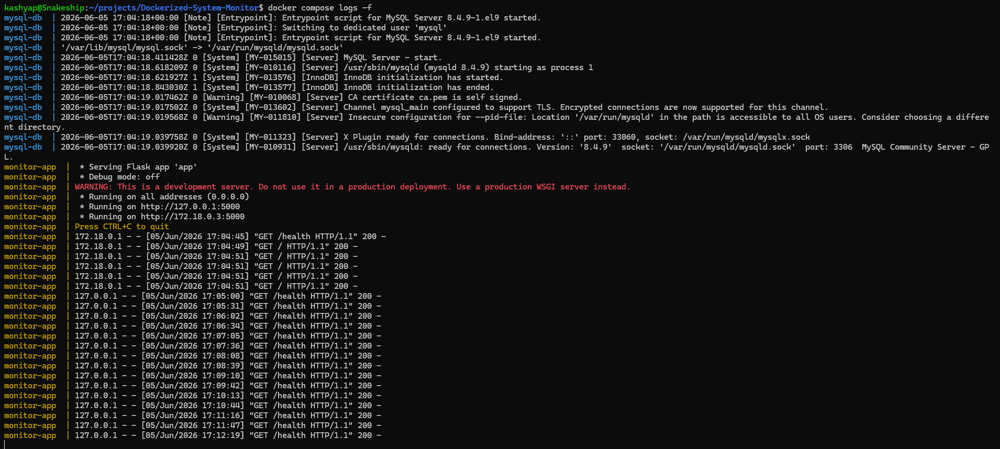

### Application Dashboard

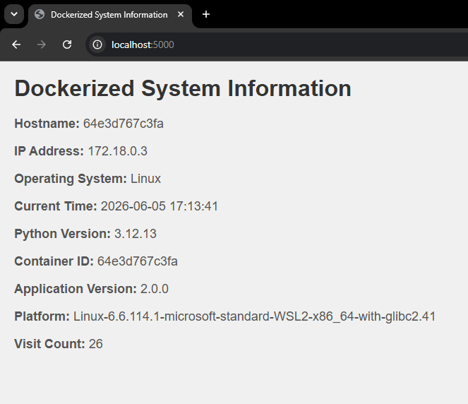

### Health Endpoint

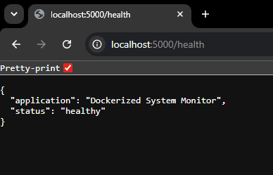

### Docker Volume

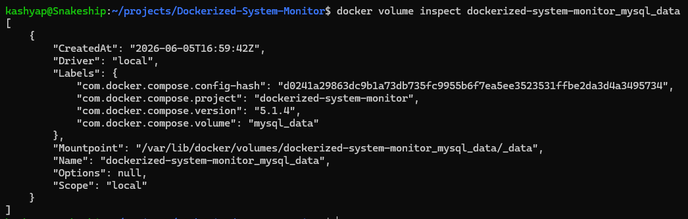

### Docker Network

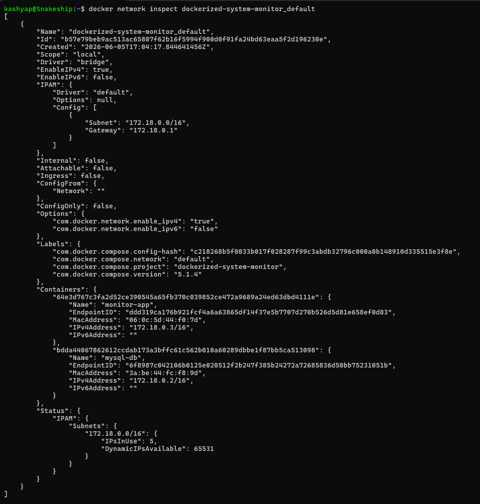

### Volume Persistence


---

## Learning Outcomes

Through this project I gained hands-on experience with:

* Docker Image Creation
* Dockerfile Best Practices
* Container Lifecycle Management
* Docker Compose
* Docker Networking
* Docker Volumes
* Environment Variables
* MySQL Containerization
* Health Checks
* Multi-Container Applications
* Persistent Storage Management

---

## Future Improvements

* Deploy to AWS EC2
* Add Nginx Reverse Proxy
* Add Prometheus Monitoring
* Add Grafana Dashboard
* Implement CI/CD using GitHub Actions
* Push Docker Images to Docker Hub
* Deploy on Kubernetes

---

## Author

Kashyap Kurani

Cloud | DevOps | AWS Engineer Learning Portfolio
